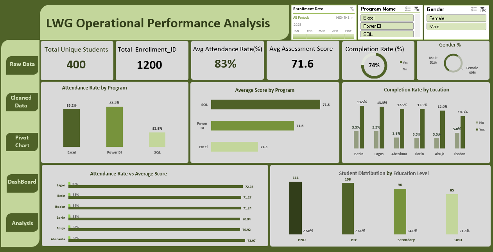
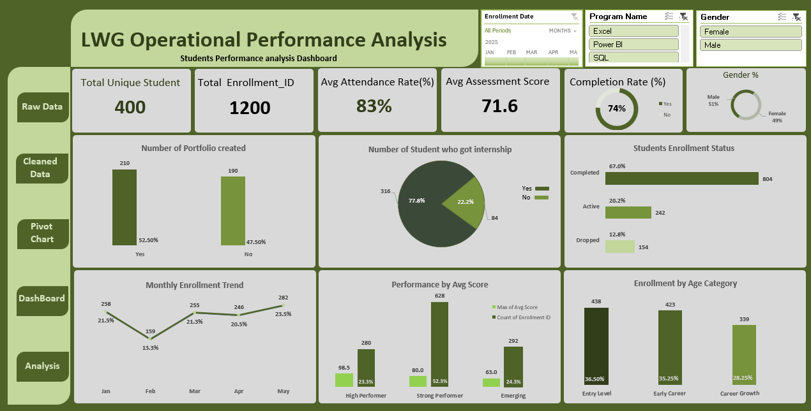

# LWG-Operational-Performance-Analysis
Student Learning Journey &amp; Programme Effectiveness

This project analyses the end-to-end learning journey of students enrolled in LWG training programmes to evaluate engagement, performance, completion outcomes, and employability readiness.

## The goal of the analysis was to help management understand:

-	How effectively training programmes are performing
-	Whether student engagement translates into strong learning outcomes
-	Where targeted interventions can improve completion and employability
  
The analysis covers 400 unique students across six learning locations who enrolled between January and May 2025 in three technical programmes:

-	Excel
- Power BI
-	SQL
  
Using data cleaning, exploratory analysis, and dashboard visualization, the project identifies operational strengths and areas where strategic improvements can increase programme impact.

## Business Problem

Training organizations must continuously evaluate whether their programmes are delivering meaningful learning outcomes and career readiness.

Management wanted to answer the following key questions:

-	Are students actively engaging with the programmes?
-	Are learning outcomes consistent across programmes and locations?
-	Which locations or student groups may require additional support?
-	Are students leaving the programme with skills that improve employability?
  
This project provides data-driven insights to support better operational and learning decisions.

## Dataset Description

The dataset contains 1,206 enrolment records across 21 variables, including:

-	Student demographics
-	Programme enrolment
-	Attendance records
-	Assessment scores
-	Completion status
-	Portfolio development
-	Internship placement outcomes
  
After cleaning and validation, the dataset represented:

-	400 unique students
-	6 learning locations
-	3 technical training programmes

## Data Cleaning Process

Before conducting the analysis, the dataset required several preprocessing steps to ensure reliability.

Issues Identified
-	Two columns contained entirely missing values
-	Three blank rows were present
-	Duplicate enrolment records were detected
-	Text inconsistencies in categorical fields
  
## Cleaning Actions

-	Removed empty columns and blank rows
-	Standardized categorical text values
-	Removed duplicate enrolment records (IDs 10 and 15)
-	Validated consistency across key fields
  
These steps ensured that the analysis is built on accurate and trustworthy data.

## Tools & Skills Demonstrated
This project demonstrates practical data analytics skills including:

Tools
-	Excel – Data cleaning and preparation
-	Power BI – Data modeling and dashboard development
-	Pivot Tables – Aggregation and exploratory analysis
  
Skills
-	Data Cleaning
-	Exploratory Data Analysis (EDA)
-	Data Visualization
-	Operational Performance Analysis
-	Business Insight Generation
-	Data Storytelling

## Dashboard

Below is the operational dashboard developed to monitor programme performance and student outcomes.

## Key Insights

Student Demographics
-	400 unique students aged between 18 and 35
  
-	Balanced gender distribution:
  
    Male: 51%
   
    Female: 49%
    
## Education Background

Education Level	Representation
- HND	28.7%
- BSc	26.9%
- Secondary	23.3%
- OND	21.1%
  
This diversity highlights the need for inclusive and adaptive learning strategies.

## Student Engagement

Average attendance across all programmes:

83%

This indicates strong learner engagement and commitment.

## Attendance by Programme

Programme	Attendance
- Excel	83.2%
- Power BI	83.2%
- SQL	82.8%
  
Engagement levels are consistent across programmes, suggesting balanced course delivery and scheduling.

## Student Performance

Average assessment scores are also highly consistent:

Programme	Average Score
- Excel	71.3
- Power BI	71.6
- SQL	71.8
  
This indicates standardized instruction quality and fair assessment frameworks.

## Programme Completion Outcomes

Overall programme outcomes:

-	Completed: 67%
-	Active: 20%
-	Dropped: 13%
  
Total completion rate:

74%

This reflects strong learner persistence but still leaves room for improvement.

## Completion Rate by Location

Location	Completion Rate

Ilorin	79%

Abuja	79%

Abeokuta 78%

Benin	71%

Lagos	71%

Ibadan	67%

Locations such as Ibadan and Lagos show comparatively lower completion rates, indicating potential operational or support challenges.

## Attendance vs Performance Insight

The analysis revealed that attendance does not perfectly correlate with performance.

For example:

-	Abeokuta recorded the highest average score (72.97) despite having similar attendance levels to other locations.

This suggests that learning outcomes depend on multiple factors, including:

-	Learning style
-	Prior knowledge
-	Access to learning resources

## Portfolio Development Gap

Portfolio creation is a strong indicator of practical skill application and employability readiness.

Portfolio Status	Students
- Created	52.5%

- Not Created	47.5%

Nearly half of the students complete the programme without a portfolio of work, which could affect job readiness.

## Internship Placement Outcomes

Internship placement is a key indicator of career transition success.

Placement Status	Students
- Placed	79%
- Not Placed	21%
  
While placement rates are relatively strong, one in five students still struggle to secure opportunities.

## Strategic Recommendations

Based on the analysis, several actions could improve programme outcomes:

1. Maintain Programme Structure

2. Engagement and performance across programmes are consistent and stable.

3. Improve Location-Specific Support

4. Provide targeted operational improvements in Ibadan and Lagos.

5. Strengthen Employability Preparation

**Introduce structured support for:**

-	Portfolio development
-	CV and LinkedIn optimization
-	Interview preparation
-	Employer partnerships
  
**Implement Early Risk Detection**

Create dashboards that flag students with:

-	Low attendance
-	Missing portfolios
-	Poor assessment performance
	
Early intervention can reduce dropouts and improve completion rates.

## Final Reflection
The analysis reveals that the training programmes demonstrate strong engagement, consistent academic performance, and solid completion outcomes.

However, the data also highlights opportunities to further strengthen programme impact by improving:

-	Career readiness
-	Portfolio development
-	Location-specific student support
  
Addressing these areas can significantly enhance student success, employability outcomes, and organisational impact.

